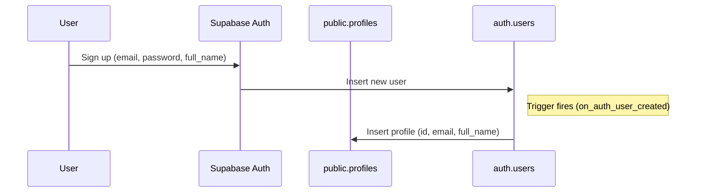

# Vehicle Booking Flow Progress

## Current State (Updated - Hourly Pricing System)

### ✅ Implemented
- **Search vehicles:** Users can search by location and date using the Booking Widget.
- **List/filter vehicles:** Vehicles are listed and can be filtered/sorted on `/vehicles`.
- **Vehicle details page:** `/vehicles/[id]` page displays vehicle information and booking form.
- **Hourly booking form:** Users can select start/end times with minimum 3-hour gap requirement.
- **Real-time availability checking:** System checks for conflicting bookings before payment.
- **Booking submission:** Complete logic to create bookings in the database with hour-based calculations.
- **Payment integration:** Full Razorpay payment integration with order creation and verification.
- **Booking confirmation:** Automatic booking confirmation after successful payment with conflict resolution.
- **Direct booking flow:** No admin verification required - instant booking upon payment.

### 🚧 Partially Implemented
- **User booking management:** Dashboard exists (`/dashboard/orders`) but may need updates for hourly display.
- **Database schema:** Updated for hourly pricing, migration script created but needs to be run.

### ❌ Not Yet Implemented
- **Booking cancellation:** No cancellation logic implemented.
- **Booking modification:** No ability to modify existing bookings.
- **Advanced filtering:** No filtering by price range, fuel type, etc.

## Current Pricing Model
- **Hourly pricing:** All vehicles now use per-hour pricing instead of per-day
- **Minimum duration:** 3-hour minimum booking requirement
- **Real-time calculation:** Total cost = hourly rate × number of hours
- **Sample rates:**
  - Luxury Sedans: ₹5.83-6.67/hour
  - SUVs: ₹4.17-5.00/hour  
  - Sports Cars: ₹7.50-8.33/hour
  - Motorcycles: ₹1.04-1.25/hour
  - Hatchbacks: ₹1.67-1.88/hour

## Technical Implementation
- **Payment Gateway:** Razorpay (migrated from Stripe)
- **Conflict Resolution:** First-come-first-serve policy with re-validation before booking creation
- **Database Fields:** Added `total_hours` column to bookings table
- **Time Calculation:** Precise hour calculation with decimal support
- **Validation:** Start time must be in future, end time must be at least 3 hours after start

## Next Steps
1. **Run database migration:** Execute `add-total-hours-column.sql` script
2. **Update seed data:** Apply new hourly pricing to database
3. **Test end-to-end flow:** Verify complete booking process with hourly calculations
4. **Update booking dashboard:** Ensure proper display of hourly bookings
5. **Add booking management features:** Cancellation and modification capabilities

---

*Update this file as progress is made or decisions change.* 

## [Update: July 2025]

### Progress Made
- **Vehicle details and booking page implemented** (`/vehicles/[id]`):
  - Fetches and displays vehicle details (image, name, brand, model, year, price, features, etc.)
  - Simple, user-friendly booking form (pickup location, pickup/return date & time, special requests)
  - Pre-fills form fields from search parameters if available
  - Validates required fields and provides feedback
  - Submits booking to Supabase and shows confirmation
  - Redirects to dashboard after successful booking
  - UI aligned with current website style
- **Minor UI refinement:** Card padding adjusted for better spacing

### Next Planned Feature
- Integrate a map on the booking page to display the pickup location and set the user's current location as default (if permitted). 

---

## User Profile Creation Flow in Supabase

### Overview
When a user signs up via Supabase Auth, a corresponding profile is automatically created in the `public.profiles` table. This is handled by a database trigger and function.

### Flow Steps
1. **User signs up** using Supabase Auth (email, password, and optionally full name).
2. **Supabase inserts** the new user into the `auth.users` table.
3. **Trigger (`on_auth_user_created`)** fires after each new user is inserted.
4. **Function (`handle_new_user`)** runs, inserting a row into `public.profiles` with the user's ID, email, and full name.

### SQL Code
```sql
-- Create function to handle new user signup
CREATE OR REPLACE FUNCTION public.handle_new_user()
RETURNS TRIGGER AS $$
BEGIN
  INSERT INTO public.profiles (id, email, full_name)
  VALUES (NEW.id, NEW.email, NEW.raw_user_meta_data->>'full_name');
  RETURN NEW;
END;
$$ LANGUAGE plpgsql SECURITY DEFINER;

-- Create trigger to automatically create profile on user signup
DROP TRIGGER IF EXISTS on_auth_user_created ON auth.users;
CREATE TRIGGER on_auth_user_created
  AFTER INSERT ON auth.users
  FOR EACH ROW EXECUTE FUNCTION public.handle_new_user();
```

### Visual Flow


### Notes
- The `public.profiles` table is always kept in sync with new users via this trigger.
- You can customize the function to add more fields or logic as needed. 